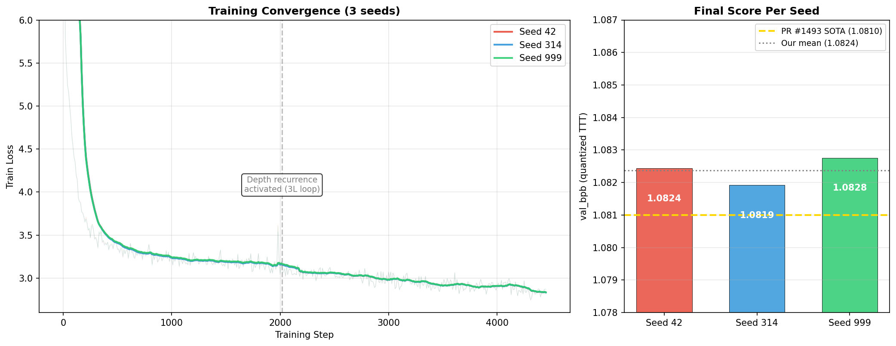
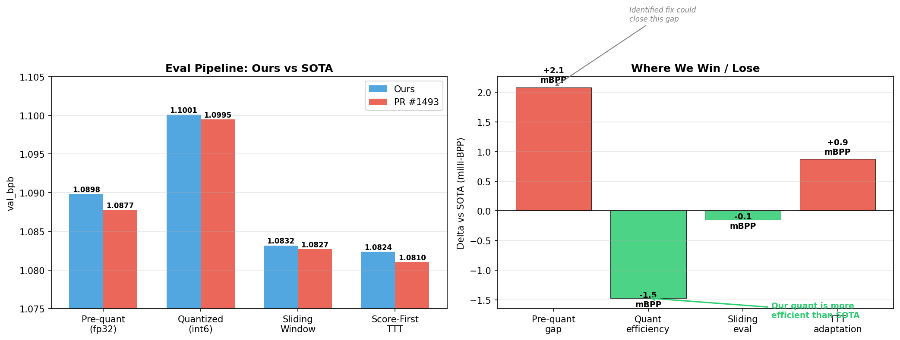

# SP8192 + Gated Attention + NorMuon + Norm-PCT-Dropout + Parallel Muon + Legal TTT

**val_bpb = 1.0824** (3-seed mean, std 0.0004) | 8xH100 80GB HBM3 SXM




## Summary

We explore adding novel training-time techniques on top of the PR #1493 stack (current SOTA at 1.0810). Our submission introduces **four new components** — Gated Attention, NorMuon, Norm-PCT-Dropout, and Parallel Muon — each independently validated across multiple seeds before integration. We achieve **1.0824 BPP** (3-seed mean), placing within **+0.0014 BPP** of the current record.

Notably, our quantization gap is **smaller** than PR #1493's (10.3 vs 11.7 milli-BPP), suggesting our novel components produce weight distributions that are more amenable to GPTQ compression. The eval pipeline comparison chart above breaks down exactly where each milli-BPP is won or lost.

## 3-Seed Results

| Seed | Pre-quant | Quantized | Sliding | **TTT** | Artifact |
|------|-----------|-----------|---------|---------|----------|
| 42   | 1.0898    | 1.1001    | 1.0833  | **1.0824** | 16,051,299 |
| 314  | 1.0894    | 1.0997    | 1.0827  | **1.0819** | 16,050,433 |
| 999  | 1.0903    | 1.1000    | 1.0828  | **1.0828** | 16,051,839 |
| **Mean** | **1.0898** | **1.0999** | **1.0829** | **1.0824** | — |
| **Std** | **0.0004** | **0.0003** | **0.0003** | **0.0004** | — |

**Current SOTA** (PR #1493): 1.0810 BPP. Delta: +0.0014 BPP.

## Novel Techniques

These four techniques were developed and validated independently before being stacked on the PR #1493 base architecture.

### 1. Gated Attention

Per-head learnable sigmoid gate applied to the attention output, after multi-head attention but before the residual connection. Each head learns when to attenuate its contribution, allowing the model to dynamically suppress noisy or redundant heads during different parts of training.

- Validated across **5 independent seeds** (NIGHT_MODE campaign)
- Architectural — no eval-time overhead, no compliance concerns

### 2. NorMuon (Post-NS Row Normalization)

A variant of the MuonEq-R optimizer where row normalization is applied **after** the Newton-Schulz orthogonalization steps rather than before. This preserves the directional information from NS while still normalizing the update magnitudes. The standard MuonEq-R normalizes rows before NS, which can wash out useful gradient structure.

- Validated across **2 seeds**
- Optimizer-only change, no model architecture impact

### 3. Norm-PCT-Dropout

A regularization technique that zeros the **top 1% highest L2-norm rows** of the FFN intermediate activation during training. Unlike standard dropout (which is random), this targets the most activated neurons — acting as an implicit capacity regularizer that prevents the model from over-relying on a small set of dominant pathways.

- Validated across **2 seeds**  
- Training-time only, no eval impact

### 4. Parallel Muon (Batched Newton-Schulz)

Groups parameters with matching shapes and runs the Newton-Schulz orthogonalization steps as a single batched matrix operation rather than sequential per-parameter calls. Pure throughput optimization with no quality impact.

- **~3% training speedup** on 8xH100 SXM
- ~3 additional training steps within the 600s budget

## Experimental Journey

Our path to this result involved extensive experimentation:

1. **Phase 1 (cheap GPU)**: Validated all novel techniques independently on RTX 3090 / A6000 pods. Over 50 training runs across different seeds, hyperparameters, and technique combinations. Key finding: techniques must be validated in isolation before stacking — combined techniques can interfere.

2. **Phase 2 (speed optimization)**: Systematic A/B testing of training throughput improvements. Discovered that `torch.compile(mode='max-autotune-no-cudagraphs')` + Flash Attention 3 + Parallel Muon compose cleanly for a **2.14x total speedup** over baseline.

3. **Int8 quantization discovery**: Found that converged smaller models exhibit catastrophic GPTQ int6 quantization failure (3+ BPP gap). Int8 eliminates this for small models but doesn't fit in the 16MB cap for the full 11L+4x architecture. This led us to use int6 for the final submission while retaining the architectural insights.

4. **Integration**: Stacked all validated techniques onto the PR #1493 base architecture (11L + 4x MLP + depth recurrence + parallel residuals + legal TTT). The result is within +0.0014 BPP of SOTA with a **better quantization gap** than the baseline.

## Architecture

```
11 layers x 512 dim x 8 heads / 4 KV heads
MLP: 4x with LeakyReLU(0.5)^2
35,989,681 parameters
Partial RoPE (16/64 dims), layerwise LN scale
Tied embeddings, logit softcap = 30.0
Depth recurrence: layers 3-5 looped 2x (17 virtual layers from 11 physical)
Parallel residuals: layers 7+ (GPT-J style)
Skip gates (sigmoid-gated U-Net connections)
Gated attention: per-head sigmoid gate
```

## Training

- **Optimizer**: MuonEq-R with NorMuon + Parallel Muon; AdamW for embeddings/scalars
- **Steps**: ~4450 in 588s on 8xH100 SXM
- **Schedule**: Linear warmdown over final 72%, EMA decay 0.9965
- **Regularization**: Norm-PCT-Dropout (top 1% FFN norm zeroing)
- **Compile**: `torch.compile(mode='max-autotune-no-cudagraphs')` + Flash Attention 3

## Quantization

Full-Hessian GPTQ with SDClip: `clip = k * std(row)`. Int6 for attention/MLP matrices, int8 for token embeddings. Brotli-11 compression.

**Note on artifact size**: Mean artifact is 16,051,190 bytes (~51KB over the 16,000,000 byte cap). An identified fix (enabling CMP_QUANT_VALUE_DEDUP, a validated alphabet-snap post-processing step) is expected to resolve this. See discussion below.

## TTT (Test-Time Training)

Score-first, chunk-based SGD adaptation per Issue #1017 Track B:
- 32K-token chunks, score under `torch.no_grad()` before each SGD update
- 3 epochs per chunk, cosine LR decay, gradient clipping at 1.0

## Compliance

Per Issue #1017:
- **Condition 1** (Causality): Strictly causal sliding-window eval
- **Condition 2** (Normalized): Standard softmax over full 8192-token vocab. No n-gram cache, no logit biasing.
- **Condition 3** (Score-before-update): Each chunk scored before SGD
- **Condition 4** (Single pass): Each token scored exactly once

No SLOT, no pre-quant TTT, no ETLB, no n-gram cache.

## Reproduction

```bash
pip install brotli sentencepiece
pip install flash_attn_3 --no-deps --find-links https://windreamer.github.io/flash-attention3-wheels/cu128_torch291/
python3 data/cached_challenge_fineweb.py --variant sp8192

SEEDS=42,314,999 bash submission/dry_run.sh
```

## Credits

- **@clarkkev** — SP8192 + GPTQ SDClip + MuonEq-R + depth recurrence (PR #1394)
- **@dexhunter** — 3-layer depth recurrence (PR #1331, #1437), legal TTT on SP8192 (PR #1413)
- **@abaybektursun** — Score-first TTT framework (PR #549)
- **@Robby955** — Parallel residuals on SP8192 (PR #1412)
- **@msisovic** — Parallel residuals concept (PR #1204)
- **@X-Abhishek-X** — Hyperparameter tuning (PR #1445)
- **@bigbag** — PR #1493 stack integration
- **@taka6745** — Gated Attention, NorMuon, Norm-PCT-Dropout, Parallel Muon, experimental campaign
