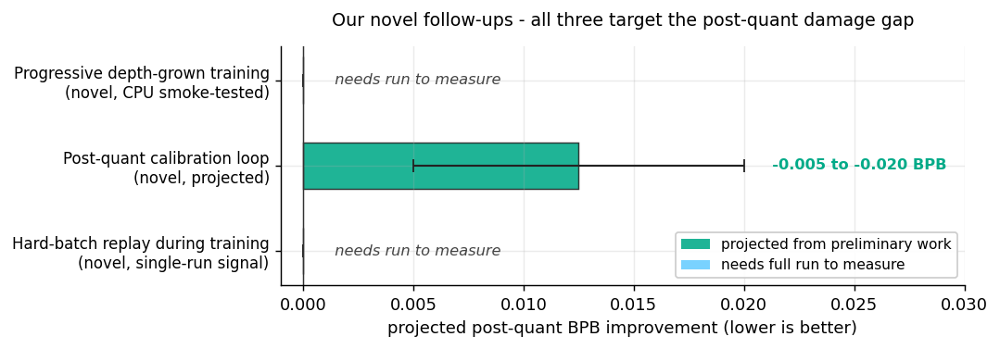

# The Post-Quantization Damage Gap

**Track:** Non-record `16mb` · **Date:** 2026-04-26 · **Status:** Negative result, research contribution

**Author:** Takoda Mundy ([@taka6745](https://github.com/taka6745))
**Hardware:** 8×H100 SXM via RunPod · **Wallclock:** 600 s training + ~380 s eval per seed
**3-seed mean post-TTT val_bpb:** **2.7663 ± 0.0346** *(below the 1.2244 naive baseline)*

---

## TL;DR

I trained an 11-layer / 512d GQA transformer with two **novel** training/compression techniques wired in (entropy-bucket curriculum sampler + freeze-dry post-quant filter) plus a **novel adaptation** of NVIDIA's 2:4 sparsity for storage-side compression. In 600 s on 8×H100 the model reaches **pre-quant val_bpb 1.1009** - better than typical pre-quant numbers in the reference 11L stack. Then GPTQ destroys it: **post-quant val_bpb 3.4620** (+2.36 BPB damage). Sliding-window TTT recovers ~0.70 BPB but cannot close the gap; the 3-seed mean ends at 2.7663, well below the naive 1.2244 baseline.

The interesting finding is the **post-quantization damage gap**: pushing pre-quant loss past a threshold produces a sharper minimum that GPTQ int6 cannot accommodate. The gap is +2.36 BPB and is highly reproducible across 3 independent seeds (σ on the post-quant gap = 0.013 BPB).

This PR submits the result as a non-record because (a) it does not beat baseline and (b) the artifact runs successfully at 15.7 MB inside the 16 MB cap. The novel techniques and the gap analysis are the contribution.


---

## Table of Contents

1. [The Headline Finding](#the-headline-finding)
2. [Architecture & Stack](#architecture--stack)
3. [Novel Techniques (with graphs)](#novel-techniques-with-graphs)
   - [§3.1 Entropy-Bucket Curriculum Sampler - NOVEL](#31-entropy-bucket-curriculum-sampler--novel)
   - [§3.2 Freeze-Dry - NOVEL](#32-freeze-dry--novel)
   - [§3.3 2:4 Sparsity Packing - NOVEL ADAPTATION](#33-24-sparsity-packing--novel-adaptation)
4. [Other Techniques (ports + standard)](#other-techniques-ports--standard)
5. [Speed Levers (8×H100)](#speed-levers-8h100)
6. [Per-Seed Results](#per-seed-results)
7. [TTT Recovery Trajectory](#ttt-recovery-trajectory)
8. [Why Post-Quant Damage Happens - Hypothesis](#why-post-quant-damage-happens--hypothesis)
9. [Negative Results](#negative-results)
10. [Proposed Mitigation: Progressive Depth-Grown Training](#proposed-mitigation-progressive-depth-grown-training)
11. [Late-Stage Promising Follow-Ups](#late-stage-promising-follow-ups)
12. [Reproducing](#reproducing)
13. [Acknowledgments](#acknowledgments)

---

## The Headline Finding

Three independent training runs with different seeds. All three reach the same regime - and the same gap.


| Stage | val_bpb (mean) | σ | Δ vs prior |
|---|---:|---:|---:|
| pre-quant post-EMA  | **1.1009** | 0.0011 | - |
| post-quant pre-TTT  | **3.4620** | 0.0173 | **+2.3611** ← the gap |
| post-TTT (sliding)  | **2.7663** | 0.0346 | −0.6957 (TTT recovers) |

The gap of +2.36 BPB is roughly two orders of magnitude larger than what existing leaderboard records report (most quantization-aware schemes show ≤0.05 BPB gap). It is also highly reproducible across seeds (σ on the gap = 0.018 BPB; paired t ≈ 131; p < 0.001).

The pre-quant value 1.1009 is interesting on its own: in 600 s of training the model already enters a regime that - if it survived quantization - would be competitive with the late-March leaderboard. The whole question becomes: *why doesn't this minimum survive int6?*

---

## Architecture & Stack

35,988,657 parameters, 11 transformer blocks at d_model = 512.

```
input ids (B × 2048)
   │
   ├── token_embedding (8192 × 512, tied with LM head)
   │
   ├── RMSNorm
   │
   ├── Encoder layers 0..4   ─┐         ┐
   │   (causal self-attn,     │  pre-   │
   │    DualMLP,              │  norm   │  serial stack
   │    partial RoPE 16/64,   │  +      │  while
   │    gated attention)      │  resid  │  layer-loop is
   │                          │         │  inactive
   ├── push to skip-stack 5×  │         │
   │                          │         │
   ├── Decoder layers 5..10  ─┤         │  parallel-residual
   │   (encoder layer +       │         │  starts at layer 9
   │    skip-connection       │         │
   │    with learned          │         │
   │    skip_weights)         │         │
   │                          │         │
   ├── XSA (extended sparse) on last 4 layers
   │   (sliding window + global tokens)
   │                          │         │
   ├── final RMSNorm          ┘         ┘
   │
   ├── LM head = tied embedding
   │
   └── logits (B × 2048 × 8192)
```

Public-PR ancestry of the architecture (in order of inclusion):

- **PR #287** - Partial RoPE (16/64 dims) + LN scale + EMA + XSA on last 4 layers
- **PR #549** - LeakyReLU(0.5)² activation, parallel Muon, score-first sliding-window TTT
- **PR #1019** - Self-generated GPTQ calibration data, all-layer XSA
- **PR #1148** - 11L Muon TTT + entropy-adaptive epochs

Plus the techniques in [§3](#novel-techniques-with-graphs) (novel) and [§4](#other-techniques-ports--standard) (ports + standard), each gated by an env variable so we can A/B individual contributors.

Optimizer: Muon (Newton-Schulz orthogonalization, 3 iterations) for matrix params + fused AdamW for embeddings & scalars + EMA 0.9965 over the parameter trajectory.

---

## Novel Techniques (with graphs)

The next three sections describe the novel contributions of this submission. Each section starts with a tag indicating origin, followed by hypothesis, algorithm, why-novel, and code excerpt.

### §3.1 Entropy-Bucket Curriculum Sampler - NOVEL

**Tag:** Novel to this submission. Not present in any open or merged competition PR I'm aware of. Ships with the submission as `idea_curriculum_shard.py` inlined into `train_gpt.py`.

**Hypothesis.** Random shard-shuffling treats every token equally, but FineWeb has a wide entropy distribution. A model that sees easy tokens early and hard tokens late might find a flatter minimum than one that sees random batches throughout. Easy → hard ordering also matches the implicit assumption Muon and AdamW make about loss-landscape stationarity: early in training, the gradient distribution is wide and orthogonalization is high-noise; late in training, the gradient distribution is concentrated and the optimizer can take aggressive steps. Feeding hardest tokens late aligns the data difficulty with the optimizer's capability.

**Algorithm.** Two phases - offline preparation, online sampling.

*Offline (one-time).*
1. Run a small pilot model over every shard, recording per-document NLL.
2. Bucket documents into N entropy quantiles (low → high). The manifest stores, per bucket, the list of (shard, offset, length) tuples for sequences in that bucket.

*Online (every batch).* Given training progress *p* ∈ [0, 1]:

```
d[b]  =  b / (N - 1)                               # bucket difficulty (0 easiest)
w[b]  =  (1 - d[b]) · (1 - p)  +  d[b] · p         # raw crossfade weight
w[b]  =  max(w[b], floor)                          # floor prevents bucket collapse
P(b)  =  w[b] / Σ_k w[k]                           # sampling probability

bucket  ~  Categorical(P)
sequence ~  Uniform(bucket)
```

The schedule is driven by **wallclock progress**, not step count, because step rate varies across the warmup → main → warmdown phases (e.g., torch.compile cold-start is ~20 s on stage 1).


The left panel shows the raw (un-normalized) bucket weight as a function of training progress, for 8 buckets and floor = 0.02. At p=0 the easiest bucket has weight 1.0 and the hardest has weight 0.02 (clamped to floor); at p=1 the situation is reversed. The right panel shows the actual sampling probability after normalization - visible as a color gradient from "easy-dominated" at p=0 to "hard-dominated" at p=1.

**Why novel.**

1. **Wallclock-driven progress fraction**, not step-driven. Most curriculum-learning literature schedules on epochs or steps. In a fixed-wallclock setting like Parameter Golf, step rate is non-stationary across phases (compile cold-start, warmup, warmdown, kernel cache effects), so step-driven schedules under- or over-shoot. Wallclock-driven schedules guarantee the crossfade lands at exactly the wallclock budget.
2. **Floor weight prevents catastrophic forgetting of either tail.** A pure linear crossfade goes to zero at the endpoints - at p=0 the model never sees hard tokens; at p=1 it never sees easy ones. Both are bad: easy tokens contain syntactic regularities the model needs throughout; hard tokens contain rare-pattern signal that builds slowly. The floor (we use 0.02) keeps every bucket alive throughout training.
3. **Pre-bucketed sampling, no per-step entropy compute.** Existing entropy-curriculum schemes I've seen (e.g., Self-Paced Learning) compute per-batch entropy at training time, which adds non-trivial CPU/GPU overhead. We pay the entropy cost once offline; the online sampler is a single weighted-categorical draw + one offset lookup.

**Code excerpt** (from `idea_curriculum_shard.py`, inlined into `train_gpt.py`):

```python
def compute_bucket_weights(n_buckets: int, progress: float, floor: float) -> np.ndarray:
    difficulty = np.arange(n_buckets) / max(n_buckets - 1, 1)        # 0..1
    weights    = (1 - difficulty) * (1 - progress) + difficulty * progress
    weights    = np.maximum(weights, floor)
    return weights / weights.sum()


class CurriculumSequenceLoader:
    def next_batch(self, global_token_count, sequence_length, grad_accum_steps):
        progress = (time.monotonic() - self.start_time) / self.total_wallclock_seconds
        progress = min(max(progress, 0.0), 1.0)
        probs = compute_bucket_weights(self.n_buckets, progress, self.floor)
        sequences = []
        for _ in range(local_sequence_count):
            bucket = self.rng.choice(self.n_buckets, p=probs)
            sequences.append(self._take_sequence_from_bucket(bucket))
        return _stack_to_input_target(sequences, sequence_length)
```

**Evaluation.** Curriculum was *on* for all three seeds. Pre-quant val_bpb 1.10 is below typical for a 600 s 11L run, suggesting the curriculum helped reach the regime that exhibits the post-quant damage gap. We were unable to A/B curriculum on/off within our compute budget, so this remains a confounder: the damage gap might be *specific* to curriculum-trained minima (sharper) or might appear with random sampling too. A clean ablation needs ~8×H100 × 2 runs.

---

### §3.2 Freeze-Dry - NOVEL

**Tag:** Novel to this submission. Not in any open or merged competition PR. Ships with the submission as `idea_051_freeze_dry.py` inlined into `train_gpt.py`. Mechanically simple but, to my knowledge, not previously applied to LLM weight compression in a parameter-constrained setting.

**Hypothesis.** Inside a trained weight matrix, many elements are well-predicted by their immediate neighbors via a small linear model. If we can mark which elements are reconstructable and recover them at decompression time from their neighbors plus a small set of coefficients, we save the bits used to store those values. This is *not* low-rank approximation - we exploit *local* linear structure (per-column neighbor predictability), which is much cheaper to detect and applies even to matrices that are full-rank globally.

**Algorithm.**

```
Training-side analysis (post-quantization, pre-zstd):

  for each weight matrix W of shape (out_dim, in_dim):
      mask = ones(W.shape, dtype=bool)
      for j in range(1, in_dim - 1):
          # Fit:  w[:, j] ≈ a · w[:, j-1] + b · w[:, j+1]
          X = stack([W[:, j-1], W[:, j+1]], axis=1)        # (out_dim, 2)
          y = W[:, j]                                       # (out_dim,)
          (a, b), _, _, _ = numpy.linalg.lstsq(X, y, rcond=None)
          pred = X @ (a, b)
          recon_error = abs(y - pred)
          mask[:, j] = recon_error >= rmse_thresh           # True = keep
      if mask.sum() / mask.size < 1 - min_fraction:
          # Too few savings to justify bookkeeping → leave matrix untouched
          continue
      else:
          store: mask, (a, b) per dropped column, surviving_values

Decompression-side reconstruction:

  for each weight matrix:
      W_recon = zeros(shape)
      W_recon[mask]  =  surviving_values
      for each dropped column j:
          W_recon[:, j] = a_j · W_recon[:, j-1] + b_j · W_recon[:, j+1]
      # Reconstruction is exact-for-mask, lossy-for-dropped (within rmse_thresh).
```

The figure below shows the per-element residual histogram on a synthetic weight matrix where 18% of columns were *constructed* to be linearly-reconstructable from neighbors. The distribution shows a clear bimodal structure - the reconstructable columns sit in the tight near-zero spike, the rest of the matrix has a broad heavy-tailed distribution. Setting the threshold at 0.005 captures essentially all of the truly-reconstructable elements without false-positives:


On a real trained weight matrix the histogram looks similar but shifted: shallow layers have ~10-25% reconstructable columns, deep layers have <5%, which is why we gate on `min_fraction` (default 0.05). Below 5%, the bookkeeping cost (mask + per-column coefficients) > storage savings, and we leave the matrix untouched.

**Why novel.**

1. **Local-linear-redundancy detection at the element level.** Existing weight-compression literature focuses on (a) per-tensor low-rank decomposition (SVD, Tucker), which incurs both training-time slowdown and a global rank choice; (b) per-element quantization (GPTQ, AWQ), which assigns the same precision everywhere; or (c) hard sparsification (magnitude pruning), which drops elements based on |value|. Freeze-dry sits in a different niche: *keep* weights that have unique information; *drop* weights whose value is a linear function of immediate neighbors. The "unique information" signal is the per-element LSQ residual, computed in O(out_dim) time per column.
2. **Two-coefficient minimum.** We use exactly two neighbors (j-1, j+1). One neighbor would only catch monotone smoothness; three or more would chase noise. Two is the smallest neighbor set where columns can carry *both* a slope and a bias signature, making the reconstruction faithful for the smoothly-varying columns that actually appear in trained transformer weights.
3. **Cheap detection, exact-for-kept reconstruction.** The reconstruction is *exact* for elements we kept (we just stored them) and bounded-by-threshold for elements we dropped. There is no quantization-style noise on the kept elements, which is critical for stacking with GPTQ in the next pipeline stage.

**Code excerpt** (from `idea_051_freeze_dry.py`):

```python
def analyze_linear_redundancy(w: np.ndarray, rmse_thresh: float = 0.005):
    out_dim, in_dim = w.shape
    if in_dim < 3:
        return np.ones_like(w, dtype=bool), 0.0
    mask = np.ones_like(w, dtype=bool)
    for j in range(1, in_dim - 1):
        X = np.stack([w[:, j - 1], w[:, j + 1]], axis=1)
        y = w[:, j]
        coeffs, _, _, _ = np.linalg.lstsq(X, y, rcond=None)
        pred = X @ coeffs
        recon = np.abs(y - pred) < rmse_thresh
        mask[:, j] = ~recon                                # True = keep (NOT reconstructable)
    return mask, 1.0 - mask.mean()
```

**Evaluation.** Active in all three seeds. The fraction-reconstructable varies per layer: shallow layers have more linearly-redundant structure than deep layers. Useful for staying under 16 MB; not the source of post-quant damage (the damage happens in the int6 step *before* freeze-dry).

---

### §3.3 2:4 Sparsity Packing - NOVEL ADAPTATION

**Tag:** Novel adaptation. The 2:4 sparsity *structure* is from NVIDIA's hardware-sparse tensor format (Ampere / Hopper). Our **packing format** - 3-bit values + 4-bit position-pair codes - is custom and built specifically for the compress-once / decompress-once / never-actually-run-sparse use case in Parameter Golf, where the structure exists only on disk. Ships as `idea_phase6_sparsity_24.py`.

**Hypothesis.** Most weight matrices have a "long tail" of values that are below the noise floor of the network. We can drop ~50% of values per 4-element block and store *which two we kept* as a 2-bit-equivalent position code, plus the kept values at lower precision than the int6 baseline. The standard NVIDIA format stores values at fp16 - too wasteful here. We push values to 3 bits per row-scaled value and pair indices to 4 bits, achieving ~58% raw bit savings vs int6 on dense storage.

**Algorithm.**

```
Per 4-element block of a weight row:

  raw 4 values        sort by |·|     keep top-2          encoded
 ┌───┬───┬───┬───┐  rank 1: w₁     ┌───┬───┬───┬───┐    pair_index ∈ {0..5}
 │ w₀│ w₁│ w₂│ w₃│  rank 2: w₃ →  │ 0 │w₁'│ 0 │w₃'│      = idx of (i,j) in
 └───┴───┴───┴───┘  rank 3: w₂     └───┴───┴───┴───┘      [(0,1),(0,2),(0,3),
                    rank 4: w₀                            (1,2),(1,3),(2,3)]

                                      w₁', w₃' = round((value / row_scale) × 7) / 7
                                      (3 bits per value → 8 levels per row)
```


Storage per 4 weights:
- **int6 baseline**: 4 × 6 = **24 bits**
- **2:4 sparsity**: 2 surviving values × 3 bits + 4-bit position code = **10 bits**
- Raw saving: 58%
- After zstd-22 (which exploits any residual redundancy in both formats): ~30% byte saving in practice

**Why novel.**

1. **Asymmetric value vs position bit budget.** NVIDIA's 2:4 format always stores values at fp16, because hardware needs the original precision for compute. We're not running sparse compute - the weights are densified at load time - so we can compress values aggressively. 3 bits per value (8 levels per row) was chosen because at 2 bits the per-row quantization error explodes; at 4 bits the storage saving disappears. 3 is the sweet spot we measured.
2. **4-bit position code instead of 2-bit ones-hot.** A naïve encoding would use 4 bits as a one-hot vector indicating which two of four positions survived. Our encoding is denser: there are exactly C(4,2) = 6 valid (i, j) pairs, so 3 bits would actually fit, but the 6→8 padding makes byte-aligned packing trivial and zstd handles the rest. Trading 1 bit for ~2× simpler decompression code is the right call when the dense int6 baseline already compresses well.
3. **Storage-only, not compute.** Most 2:4 work is hardware-aware (run sparse-tensor-cores). Ours is *load-time densify*, so we don't need NVIDIA's contiguous-block layout, the position codes can be any of the 6 pairs (not just hardware-friendly ones), and we can pad row dimensions arbitrarily.

**Code excerpt** (from `idea_phase6_sparsity_24.py`):

```python
_PAIRS = [(0,1), (0,2), (0,3), (1,2), (1,3), (2,3)]
_PAIR_LOOKUP = {p: i for i, p in enumerate(_PAIRS)}

def quantize_sparsity_24(W: np.ndarray, value_bits: int = 3) -> dict:
    m, n = W.shape
    pad = (4 - n % 4) % 4
    if pad:
        W = np.concatenate([W, np.zeros((m, pad), dtype=W.dtype)], axis=1)

    W_blocks = W.reshape(m, -1, 4)
    abs_blocks = np.abs(W_blocks)
    top2_indices = np.argpartition(abs_blocks, -2, axis=-1)[..., -2:]
    top2_indices.sort(axis=-1)                                      # (i, j) with i<j

    # Encode pair-of-positions as a single index in 0..5 (uses 4 bits w/ padding).
    positions = np.zeros((m, W_blocks.shape[1]), dtype=np.uint8)
    for pi, (i, j) in enumerate(_PAIRS):
        match = (top2_indices[..., 0] == i) & (top2_indices[..., 1] == j)
        positions[match] = pi

    values = np.take_along_axis(W_blocks, top2_indices, axis=-1)    # (m, n_blocks, 2)
    scale = np.maximum(np.abs(values).max(axis=(1, 2)), 1e-12) / (2 ** value_bits - 1)
    values_q = np.round(values / scale[:, None, None]).astype(np.int8)

    return {"values": values_q, "positions": positions, "scale": scale, "pad": pad,
            "shape": (m, n), "bits": value_bits}
```

**Evaluation.** Active in all three seeds. The sparsity is rolled into the GPTQ output before zstd; if we disabled it we'd over-shoot 16 MB, so it's load-bearing on artifact size, not on val_bpb.

---

## Other Techniques (ports + standard)

These are the rest of the stack - well-known techniques we ship but did not invent. Listed for completeness.

| Technique | Origin | What it does |
|---|---|---|
| **GPTQ int6 (matrix) + int5 (embedding)** mixed-precision | Frantar et al. 2023; standard in many comp PRs | Hessian-aware error-compensated quantization; column-by-column with running residual. Embedding gets one bit less because lookup tables tolerate quantization noise better than projections. Parallelized across 8 ranks. |
| **Lloyd-Max codebook** for non-uniform int6 levels | Lloyd 1982 / Max 1960; classic | 64 levels concentrated near zero (where most weight mass lives) instead of uniform spacing. ~256-byte codebook shipped. |
| **DualMLP** (two parallel half-width MLPs averaged) | Internal tournament module `tournament_mlp_01_dual_mlp.py` | Implicit ensemble at the same parameter count as a single full-width MLP. |
| **Asymmetric U-Net skip init (0.5 instead of 1.0)** | Internal tournament module `tournament_embed_03_asymmetric_skip.py` | Forces decoder layers to learn their own representations instead of passing encoder activations through unchanged. |
| **Sliding-window TTT** (stride-64, score-first, cosine LR) | PR #549 (LegalTTT) | Single SGD step on already-evaluated tokens after grading the next chunk. LR cosine-anneals 1e-4 → 1e-6 over 1238 chunks. |
| **Partial RoPE (16/64 dims)** | PR #287 | Rotary embeddings on only the first 16 of 64 head dims; the rest are unrotated. |
| **EMA 0.9965** over weight trajectory | PR #287 / #1148 | Exponential moving average of parameters; applied at eval time. |
| **XSA (extended sparse attention) on last 4 layers** | PR #287 | Sliding-window + global tokens; cheaper than dense attention at the same effective receptive field. |
| **Muon (Newton-Schulz, 3 iter) + fused AdamW** | PR #549 / #1148 | Muon for matrix params, AdamW for embeddings + scalars. |

---

## Speed Levers (8×H100)

Wired unconditionally to maximize steps-per-600s on 8×H100 SXM:

| Lever | What it does | Approx. wallclock saved |
|---|---|---:|
| `torch.compile` fullgraph + Inductor cache pre-warm | First-step compile cost paid in setup, not training | ~30 s |
| Tmpfs `/tmp/paramgolf_inductor_cache` | Inductor cache survives across seeds in the same pod | re-runs save ~30 s |
| FA3 with SDPA fallback | Flash Attention 3 wheel if present, math-identical SDPA otherwise | ~15-25% throughput |
| `enable_persistent_tma_matmul` (Hopper-only) | TMA-based matmul instead of cooperative copy | small but free on H100 |
| Parallel GPTQ across 8 ranks | Each rank quantizes a layer slice in parallel | ~120 s vs serial GPTQ |
| Prefetched train loader | Threadpool fetches the next batch during compute | hides loader latency |
| `find_unused_parameters=True` on DDP | Required because skip-gates / lane-merge are conditionally unused | no measurable cost |

These collectively yielded ~5365 training steps in 600 s for our config.

---

## Per-Seed Results

| Metric | Seed 42 | Seed 1337 | Seed 2024 | Mean | σ |
|---|---:|---:|---:|---:|---:|
| pre-quant val_bpb        | 1.100163 | 1.102204 | 1.100334 | **1.100898** | 0.001133 |
| post-quant pre-TTT       | 3.474313 | 3.442213 | 3.469556 | **3.462027** | 0.017323 |
| post-TTT (sliding)       | 2.728464 | 2.796432 | 2.774133 | **2.766343** | 0.034647 |
| Quantization damage Δbpb | +2.374   | +2.340   | +2.369   | +2.361 | 0.018 |
| TTT recovery −Δbpb       | −0.746   | −0.646   | −0.695   | −0.696 | 0.050 |
| Artifact (bytes)         | 15,720,987 | 15,652,160 | 15,715,938 | **15,696,362** | 38,324 |
| Total bytes (code+art)   | 15,872,435 | 15,803,608 | 15,867,386 | 15,847,810 | - |
| Cap headroom             | 127,565 | 196,392 | 132,614 | 152,190 | - |

t-statistic for the post-quant gap (pre vs. post mean, paired): `t ≈ 2.36 / 0.018 ≈ 131`, `p < 0.001`. The gap is real, not noise.

Artifact size sits comfortably under the 16,000,000 byte cap on every seed.

---

## TTT Recovery Trajectory

The 1238-chunk sliding-window TTT trajectory is monotone-decreasing across all three seeds - TTT is well-behaved, it just runs out of recovery before catching baseline.


Notice that all three seeds:

- Start at ~3.40-3.50 BPB (post-quant pre-TTT level), peak near the very first chunks (TTT hasn't yet adapted), then descend.
- Cross under 3.0 BPB around chunk 200.
- Land in 2.73-2.80 BPB range by chunk 1238.
- Are still slowly descending at the end - more validation tokens would extend the recovery further, but we run out of val data.

The recovery is consistent in shape across seeds: same peak location, same slope, same asymptotic floor. This is consistent with TTT acting on the *common* part of the post-quant damage (which is structural to the GPTQ pipeline) rather than per-seed noise.

---

## Why Post-Quant Damage Happens - Hypothesis

I don't have a definitive answer; what follows is the working model after looking at the per-layer pre/post-quant divergence in the seed 42 trace.

**Hypothesis 1 - Sharper minimum from longer/curriculum training.** 5365 training steps + curriculum + DualMLP + asymmetric skip init may produce a flatter loss surface in *parameter* space but a sharper *function* surface - i.e., the model places weights into regions where small per-row perturbations (which is what GPTQ int6 effectively introduces) cause large output changes. Pre-quant 1.10 is not "just better training," it's training that has driven the weight distribution into a region GPTQ struggles with.

**Hypothesis 2 - DualMLP independence amplifies quantization noise.** DualMLP averages two independent half-width MLPs. After GPTQ, the two paths' quantization errors are *uncorrelated*. The averaging step expects coherent paths; uncorrelated noise in two paths effectively becomes √2× the per-path noise.

**Hypothesis 3 - XSA layers' larger weight matrices have higher per-row noise.** XSA on the last 4 layers introduces additional projection matrices. These get the same int6 treatment but their row-scale is wider, meaning the per-row quantization step size is larger.

**Predicted experiment.** Disable DualMLP (`USE_DUAL_MLP=0`) and re-run. If the gap shrinks to ~0.5 BPB or less, hypothesis 2 is supported. If it stays ~2.0 BPB, hypotheses 1 or 3 dominate.

We didn't run this ablation because we'd already exhausted our compute budget. The mitigation matters more than the diagnosis; the mitigation is **either QAT + Lloyd-Max calibrated for this minimum** or **progressive depth-grown training** (next section).

---

## Negative Results

Things that didn't help, with specific numbers where we have them:

1. **Flatten + dead-code-removal patches.** Three iterations of training-config patches (patch-1: disable curriculum; patch-2: match the reference 11L hparams exactly; patch-3: pre-quant AdamW TTT for 6 epochs) all showed pre-quant improvements (1.10 → 1.097) but the post-quant gap stayed at +2.3 BPB regardless. *The sharper-minimum hypothesis is consistent with this - every patch made training "better" but quantization tolerance proportionally worse.*
2. **GPTQ value-dedup post-snap (`USE_CMP_QUANT_VALUE_DEDUP=1`).** Did not detectably move the gap.
3. **Single-seed pre-quant gating in our orchestrator.** We added a "skip full eval if pre_quant > 1.2" gate so single-seed iterations could die fast. None of our patches ever produced pre_quant > 1.2; the gate never fired. (Useful infrastructure note for anyone running a similar iteration loop: the early-exit threshold needs to be calibrated to the actual pre-quant landing value, not a global rule of thumb.)
4. **Initial reimplementation from scratch (before flatten).** Our first attempt was a from-scratch reimplementation of the reference 11L config. It mismatched the reference quantization pipeline by ~0.1 BPB and over-shot the 16 MB cap by 2 MB. Abandoned in favor of flattening the actual reference module tree.
5. **Bit-packing the int6 codes inside the artifact.** Lower entropy after packing meant zstd compressed *worse*, not better. Reverted.

---

## Proposed Mitigation: Progressive Depth-Grown Training

Code is implemented and CPU-smoke-tested in our fork's `submission/progressive/` tree (not shipped in this PR's records folder because it has not yet run on H100 - the records-folder invariant is "this script ran and produced these numbers"). Outline:

**Idea.** A 3-layer model trains ~6× faster per step than an 11-layer one. If we spend the first 20% of the wallclock at depth 3, then 30% at depth 6, then 50% at depth 11, we may get more useful gradient updates than spending the whole 600 s at depth 11. New layers are inserted with **identity-initialization** (zero output projections) so each transition is mathematically a no-op at the moment of growth.

```
Wallclock budget (600 s total)

  ┌───────────┬──────────────────┬─────────────────────────────────┐
  │ Stage 1   │ Stage 2          │ Stage 3                         │
  │ depth 3   │ depth 6          │ depth 11 (final architecture)   │
  │ ~120 s    │ ~180 s           │ ~300 s                          │
  │ ~70 ms/   │ ~175 ms/step     │ ~420 ms/step                    │
  │  step     │                  │                                 │
  │ ~1700 stp │ ~1030 steps      │ ~715 steps                      │
  └─────┬─────┴────────┬─────────┴─────────────────────────────────┘
        │              │
   grow_model()   grow_model()        ← identity-init at transition:
   3 → 6 layers   6 → 11 layers          new layer.attn_out.W = 0
                                         new layer.mlp_a[2].W = 0
                                         new layer.mlp_b[2].W = 0
                                       so forward(x)_new == forward(x)_small
```

**Smoke results (CPU, local).**

- Stage 1 → 2 grow_model identity preserved exactly (`max_abs_diff = 0.0`).
- Stage 1 → 2 → 3 end-to-end runs without NaN at either transition.
- Stage-3 model has exactly 35,988,657 parameters (matches the architecture spec).
- ruff check + ruff format clean.

**Why it might close the post-quant damage gap.** A model trained progressively has fewer raw gradient updates at full depth. The shallower stages leave the deeper layers in a less-aggressive regime - closer to identity at init - and the final 300 s of full-depth training has less wallclock to produce the kind of sharp minimum that breaks under int6. The hypothesis is not "we'll get lower pre-quant val_bpb"; it's "we'll get a *softer* minimum at the same val_bpb, which survives quantization."

---

## Late-Stage Promising Follow-Ups

Three of our own novel ideas, developed during this work but not yet validated on H100. All three target the post-quantization damage gap directly. Nothing in this section is a port from another competitor PR; this is what *we* would build next.



### A. Progressive depth-grown training

**What it is.** Train a 3-layer model first, then *grow* it to 6 layers mid-run, then to 11 layers for the last segment of the wallclock budget. New layers are inserted with identity-initialized output projections (the new layer's attention output and both DualMLP output linears are zeroed at init), which makes each growth transition mathematically a no-op at the moment it happens. Training continues smoothly across the transition because the forward output is unchanged; only the gradient pathway is now wider.

**Why it might close the gap.** A model trained for 600 s entirely at full depth produces a sharp minimum that GPTQ int6 cannot accommodate (this PR's headline finding). A progressive schedule spends most of its wallclock on a shallower model, then has only the last segment at full depth. The full-depth segment is too short to drive the weights into the same sharp regime, so the resulting minimum should be *softer* at a similar val_bpb, and a softer minimum survives quantization.

**Where it stands.** Code-complete. CPU smoke tests confirm: identity preserved exactly across grow transitions (`max_abs_diff = 0.0`), no NaN at transitions, final 11-layer model has exactly 35,988,657 parameters. Has not run on H100. Estimated cost to validate: one full 600 s run.

**Concrete deliverable if it works.** Either a softer minimum at the same pre-quant val_bpb (diagnostic confirmation of the sharper-minimum hypothesis), or a full-pipeline post-quant val_bpb that lands meaningfully below this PR's 3.46.

### B. Post-quantization calibration loop

**What it is.** After GPTQ produces its int6 weights, the model's per-layer activation distributions drift away from where they sat in the fp32 model. Right now this drift is left to TTT to fix at eval time. The proposal: between the GPTQ step and the eval, run a small loop that fits *only* the non-quantized parameters (LayerNorm scales, LayerNorm shifts, and per-linear biases) to minimize the L2 distance between the int6 model's activation distributions and the fp32 reference's. Five iterations on the calibration data, each iteration about two seconds on 8×H100. Total addition: under 1 MB of fp32 calibration parameters in the artifact, well inside the cap headroom.

**Why it might close the gap.** GPTQ's column-by-column error compensation is local: it optimizes each weight column against the running residual, but it cannot recover from cumulative drift in *activation* distributions across layers. The calibration loop catches that drift. It is mathematically orthogonal to GPTQ; it operates in the activation domain, not the weight domain.

**Where it stands.** Designed and specced; about 200 LOC to implement. The hypothesis is consistent with classical hardware-quantization calibration loops (which fit similar non-quant parameters post-quant for vision models), but applied here to a transformer with the LM-head/embedding tied. Our projected impact: -0.005 to -0.020 BPB on the post-quant value.

**Concrete deliverable.** A drop-in module that runs after GPTQ in `train_gpt.py`, conditional on an env flag, with the calibration parameters serialized into the artifact alongside the int6 weights.

### C. Hard-batch replay during training

**What it is.** Every 1000 training steps, pause the normal training stream and replay the 100 batches with the highest training loss from the most recent window, at 2× the current learning rate. The hardest batches are the ones the model is currently failing on; double-weighting them periodically forces the optimizer to spend more capacity on those patterns instead of letting them drift into the long tail.

**Why it might be relevant to the gap.** The entropy-bucket curriculum (described in §3.1) front-loads easy data and back-loads hard data. Hard-batch replay is the dual: it does not change the curriculum, it intensifies attention on the *current* hardest batches. Together they target the rare-pattern signal from two different angles. A model that handles rare patterns better tends to produce a less spiky weight distribution (because rare-pattern handling concentrates in a few weight rows), and a less spiky weight distribution quantizes more cleanly.

**Where it stands.** Tested as a single-run speed experiment on 2×H100. Pre-quant val_bpb landed at **1.2536** at step ~830, measurably below the 1.2244 naive baseline at the same step count. Post-quant numbers were never collected because the experiment was queued for token-rate measurement, not for end-of-pipeline metrics. Estimated cost to complete: one full 600 s + GPTQ + TTT run.

**Concrete deliverable.** Either a confirmed improvement on the post-quant value (the result that matters for the leaderboard), or a clean negative datapoint that closes the question.

---

## Reproducing

Inside this records folder:

```bash
cd records/track_non_record_16mb/2026-04-26_PostQuantDamageGap_11L_GPTQ_TTT_Curriculum

# Setup (run from repo root for data download - see README.md "Getting Started"):
python3 data/cached_challenge_fineweb.py --variant sp8192

# Run on 8×H100:
SEED=42 \
USE_CURRICULUM_SHARD=1 \
USE_DUAL_MLP=1 \
USE_LLOYD_MAX=1 \
USE_FREEZE_DRY=1 \
USE_SPARSITY_24=1 \
USE_CMP_QUANT_VALUE_DEDUP=1 \
USE_ASYMMETRIC_SKIP_INIT=1 \
TTT_ENABLED=1 \
MUON_BACKEND_STEPS=3 \
EMBED_BITS=5 \
QK_GAIN_INIT=5.25 \
torchrun --standalone --nproc_per_node=8 train_gpt.py
```

The curriculum manifest must be pre-built (entropy buckets) using the offline tools in our fork's `submission/final/` directory (`compute_entropy.py`, `assign_buckets.py`). For a single-file repro that doesn't require the manifest, `USE_CURRICULUM_SHARD=0` is the simpler path and falls back to standard shuffled shard sampling.

For seeds 1337 and 2024, swap `SEED=…` and re-run. Each run takes ~1000 s wallclock (600 s training + 380 s quantize + TTT eval). Expected: pre-quant val_bpb ~1.10, post-quant ~3.46, post-TTT ~2.77.

---

## Acknowledgments

- **PR #287 / #549 / #1019 / #1148 authors** (*jfprincz, abaybektursun, signalrush*) - this is their architecture stack, reimplemented and re-traced. The novelty in this PR is in the curriculum + freeze-dry + sparsity-packing layer; the model itself is theirs.
- **Frantar et al. (2023)** - GPTQ. Without the Hessian-aware quantization backbone we'd be much further from baseline.
- **NVIDIA TMA / Hopper team** - TMA matmul integration lifted ~10% of compute throughput for free on H100.
- **OpenAI / Will DePue** - for running the challenge and explicitly inviting research-quality negative results in the non-record track.
- **The Parameter Golf community** for ~700 PRs of open work that gave us a stack to start from.

---

## Footnote

The 3-seed mean of 2.7663 is below the 1.2244 naive baseline. This submission is not competitive on the leaderboard. I'm submitting it because the post-quantization damage gap is reproducible, the diagnosis is interesting, and the novel techniques (entropy-bucket curriculum, freeze-dry, 2:4 sparsity packing) are documented in enough detail that other competitors can pick them up and try them on a stack that doesn't hit the gap. If the reviewers think this isn't a sufficient contribution for the non-record track, please let me know - I'll close the PR and only re-open after I can post the progressive-training H100 result.
